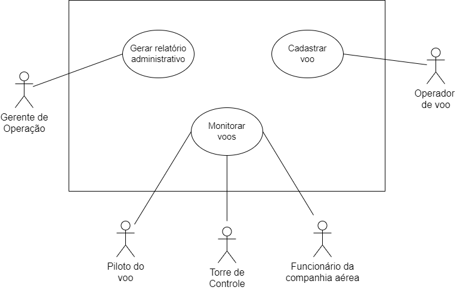

# Modelo de Casos de Uso

## Caso de Uso 1

**Nome:** Cadastrar voo

**Descrição:** Cadastrar, ler, atualizar e deletar as informações básicas de um voo, como código do voo, rota entre origem e destino e data/horário previstos de partida e chegada do voo

**Evento iniciador:** seleção de cadastro de voo no sistema

**Atores:** Operador de voo

**Pré-condição:** não aplicável

**Sequência de eventos:**

1. Operador de voo seleciona a opção de cadastro de voo.
2. Sistema solicita código de voo.
3. Operador de voo insere código de voo.
4. Sistema solicita tipo de ação.
5. Operador de voo seleciona opção de cadastro de um novo voo.
6. Sistema verifica se código inserido corresponde a um voo já cadastrado.
7. Sistema solicita informações básicas do voo.
8. Operador de voo insere as informações mínimas do voo (a companhia aérea, a rota com aeroporto de origem e aeroporto de destino do voo, data prevista de partida e horário previsto de partida, ou data prevista de chegada e horário previsto de chegada do voo).
9. Sistema exibe as informações inseridas do novo voo e solicita confirmação.
10. Operador de voo confirma as informações inseridas.
11. Sistema verifica se as informações básicas mínimas foram fornecidas no sistema e armazena as informações inseridas do novo voo.
12. Fim do caso de uso.

**Pós-condição:** informações básicas do voo cadastradas no banco de dados do sistema

**Fluxos alternativos:**

1. Operador de voo seleciona opção de leitura das informações de um voo (passo 5):
  1. Sistema verifica se código inserido corresponde a um voo já cadastrado.
  2. Sistema exibe as informações armazenadas correspondentes ao código do voo inserido
  3. Operador finaliza a operação de leitura.
  4. Fim do fluxo alternativo.

1. Operador de voo seleciona opção de atualização das informações de um voo (passo 5):
  1. Sistema verifica se código inserido corresponde a um voo já cadastrado.
  2. Sistema solicita a inserção das novas informações do voo.
  3. Operador de voo insere as novas informações do voo.
  4. Sistema verifica a consistência das informações inseridas.
  5. Fim do fluxo alternativo.

1. Operador de voo seleciona opção de exclusão de um voo (passo 5):
  1. Sistema verifica se código inserido corresponde a um voo já cadastrado.
  2. Sistema exclui as informações correspondentes ao código do voo inserido.
  3. Fim do fluxo alternativo.

**Exceções:**

1. Código de voo já cadastrado (passo 6):
  1. Sistema aciona alarme e exibe mensagem de erro ao operador de voo.
  2. Fim do fluxo da exceção.
2. Informações básicas mínimas não foram inseridas (passo 11):
  1. Sistema aciona alarme e exibe mensagem de erro ao operador de voo.
  2. Fim do fluxo da exceção.
3. Código de voo ainda não foi cadastrado (Fluxos Alternativos 1, 2 e 3 - passo a):
  1. Sistema aciona alarme e exibe mensagem de erro ao operador de voo.
  2. Fim do fluxo da exceção.
4. Informações atualizadas são inconsistentes (Fluxo Alternativo 2 - passo d):
  1. Sistema aciona alarme e exibe mensagem de erro ao operador de voo.
  2. Sistema cancela a atualização das informações do voo.
  3. Fim do fluxo da exceção.

## Caso de Uso 2

**Nome:** Monitorar voos

**Descrição:** Atualizar e visualizar as informações do voo (_status_de voo e horários de chegada e partida reais)

**Evento iniciador:** seleção de monitoramento de voos no sistema

**Atores:** Funcionários das empresas aéreas, piloto do voo e torre de controle

**Pré-condição:** não aplicável

**Sequência de eventos:**

1. Usuário seleciona a opção de monitoramento de voo.
2. Sistema solicita código de voo.
3. Usuário insere código de voo.
4. Sistema verifica se código inserido corresponde a um voo já cadastrado.
5. Usuário seleciona opção de atualizar _status_ e/ou informações temporais (data de chegada real e horário de chegada real, ou data de partida real e horário de partida real) do voo.
6. Sistema exibe informações referentes ao voo, e solicita a inserção do _status_ atualizado ou dos horários de chegada/partida reais do voo.
7. Usuário atualiza _status_ do voo ou insere horários de chegada/partida reais do voo.
8. Sistema exibe as informações atualizadas e solicita confirmação.
9. O usuário confirma a atualização das informações.
10. Sistema verifica a consistência do status atualizado e/ou dos horários de chegada/partida reais inseridos e armazena as informações atualizadas.
11. Fim do caso de uso.

**Pós-condição:** informações de _status_ e/ou dehorários de chegada/partida reais do voo atualizadas no banco de dados do sistema e exibidas no painel de monitoramento.

**Fluxos alternativos:**

1. Usuário seleciona opção de apenas visualizar as informações do voo (passo 6):
  1. Sistema exibe informações referentes ao voo.
  2. Fim do fluxo alternativo.

**Exceções:**

1. Código de voo ainda não foi cadastrado (passo 4):
  1. Sistema aciona alarme e exibe mensagem de erro ao operador de voo.
  2. Fim do fluxo da exceção.
2. _Status_ de voo ou horários de chegada/partida reais inválidos (passo 11):
  1. Sistema aciona alarme e exibe mensagem de erro ao operador de voo.
  2. Fim do fluxo da exceção.

## Caso de Uso 3

**Nome:** Gerar relatório administrativo

**Descrição:** Buscar dados históricos sobre os voos realizados no aeroporto durante um período de tempo selecionado e gerar um relatório administrativo reunindo de forma estruturada tais informações. O relatório deve abranger informações referentes ao desempenho dos voos de cada companhia aérea (tempos de atraso) e dados gerais sobre a movimentação do aeroporto (número de voos realizados por rota e por companhia aérea).

**Evento iniciador:** seleção da opção de gerar relatório administrativo no sistema

**Ator(es):** Gerente de Operação

**Pré-condição:** não aplicável

**Sequência de eventos:**

1. Usuário seleciona a opção de gerar relatório administrativo.
2. Sistema solicita o período de análise para geração do relatório.
3. Gerente de Operação insere a data de início e a data de fim da análise.
4. Sistema verifica a consistência do período de tempo fornecido, a existência de voos no período selecionado e busca as informações históricas.
5. Sistema solicita o tipo de relatório a ser gerado (geral do aeroporto ou específico à nível de voo).
6. Usuário seleciona o tipo de relatório geral do aeroporto.
7. Sistema gera relatório com informações gerais dos voos do aeroporto.
8. Fim do caso de uso.

**Pós-condição:** relatório administrativo gerado

**Fluxos alternativos:**

1. Usuário seleciona a opção de gerar relatório específico à nível de voo (passo 6):
  1. Sistema gera relatório com informações específicas dos voos do aeroporto.
  2. Fim do fluxo alternativo.

**Exceções:**

1. Período de tempo informado para análise apresenta data de início posterior a data de fim ou não há voos no período selecionado (passo 4):
  1. Sistema aciona alarme e exibe mensagem de erro ao operador de voo.
  2. Fim do fluxo da exceção.

## Diagrama de Caso de Usos:

