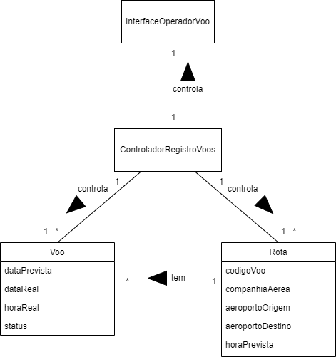

# Modelo de Classes

## Classes de controle:

- ControladorRegistroVoos (FlightRecordController)
- ControladorMonitoramento (MonitoringController)
- ControladorRelatorio (ReportController)

## Classes de fronteira:

- InterfaceOperadorVoo (FlightOperatorInterface)
- InterfacePiloto (PilotInterface)
- InterfaceFuncionarioCompanhia (AirlineEmployeeInterface)
- InterfaceTorreDeControle (ControlTowerInterface)
- InterfaceMonitoramento (MonitoringInterface)
- RelatorioGeral (GeneralReport)
- RelatorioEspecifico (SpecificReport)

## Classes de entidade:

- Voo (Flight)

## Diagramas de Classes:

### Cadastrar voo:

### Monitorar voos:

### Gerar relatório administrativo:

